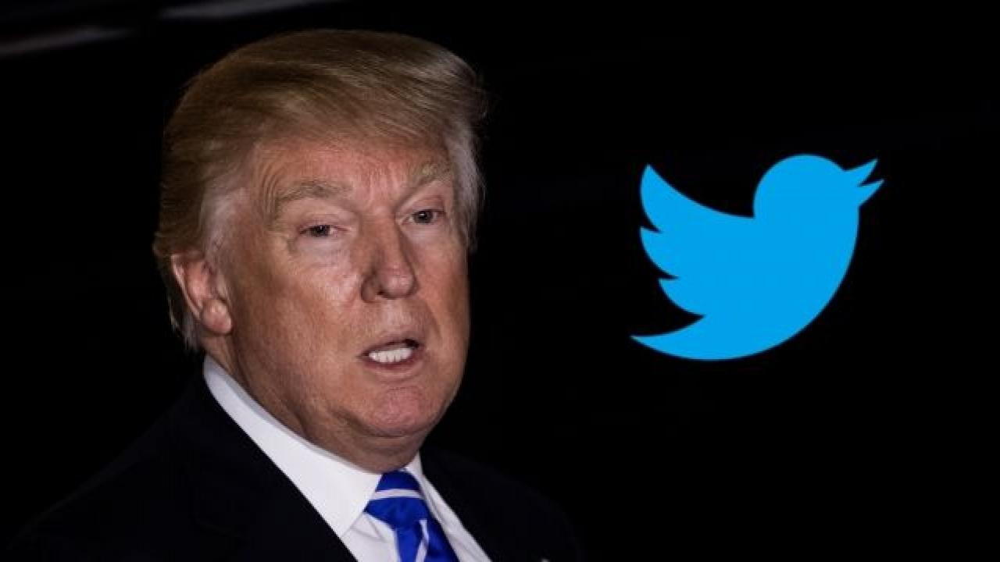
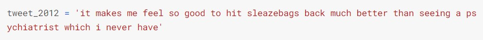
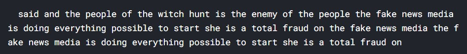
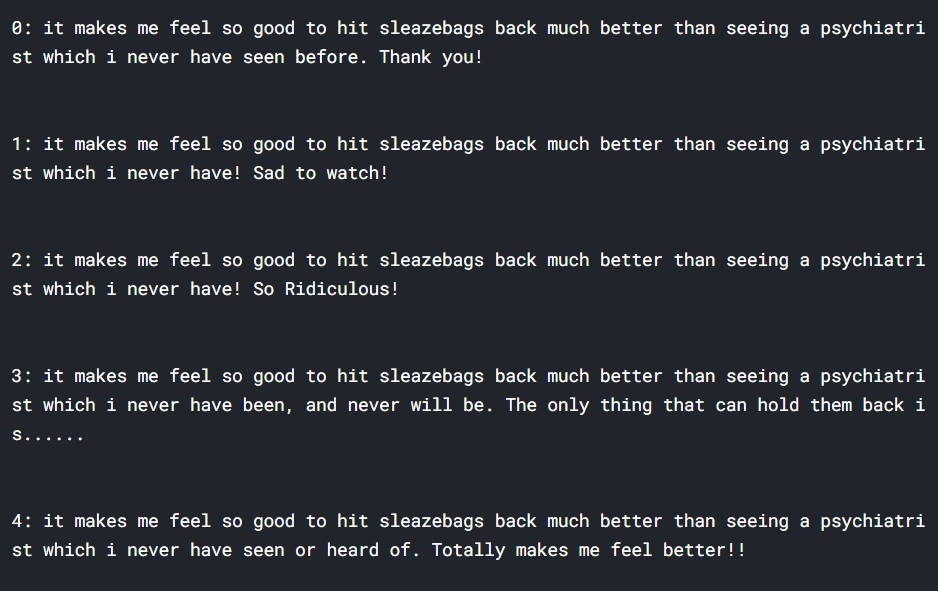

# TextGeneration

 

In this small fun project, I used [trump twitter insults](https://www.kaggle.com/ayushggarg/all-trumps-twitter-insults-20152021) dataset available on Kaggle. I used this dataset to train two models one is LSTM based and for other I tried fine-tuning GPT2 for trump tweets from 2015-2021. For extra evaluation I tried feeding a part of trump's tweet from 2012 for which output of both models are as following:

## Input Tweet
 

## Lstm Output
  

## Finetuned GPT 2 Output

